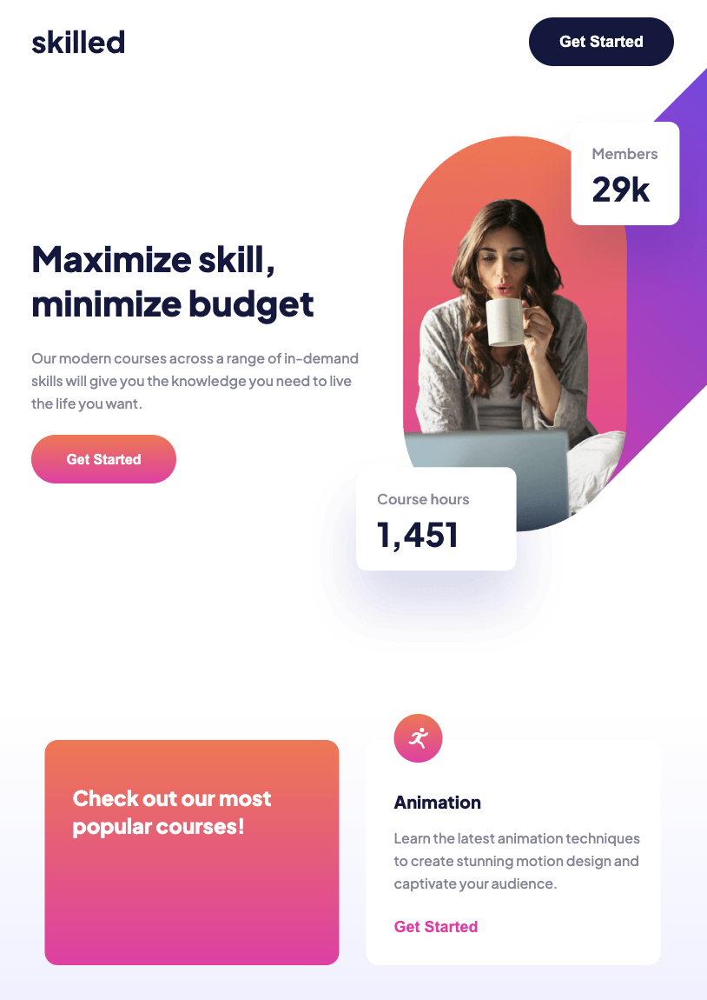

# Skilled e-learning landing page solution

This is a solution to the [Skilled e-learning landing page challenge on Frontend Mentor](https://www.frontendmentor.io/challenges/skilled-elearning-landing-page-S1ObDrZ8q).

## Overview

### The challenge

Users should be able to:

- View the optimal layout depending on their device's screen size
- See hover states for interactive elements

### Screenshots

### Links

- Solution URL - [Link here!](https://www.frontendmentor.io/solutions/skilled-elearning-landing-page-dgiwIXNBH6)
- Live Site URL - [Link here!](https://t-minini.github.io/skilled-elearning-landing-page/)

## My process

### Built with

- Semantic HTML5 markup
- CSS custom properties
- Flexbox
- CSS Grid
- Mobile-first workflow
- CSS Variables
- Finished in 6:30 hours

## Author

- Personal Website - [Link here!](https://www.tuliominini.com)
- Frontend Mentor - [@t-minini](https://www.frontendmentor.io/profile/t-minini)
- LinkedIn Profile - [Link here!](https://www.linkedin.com/in/tulio-minini/)
